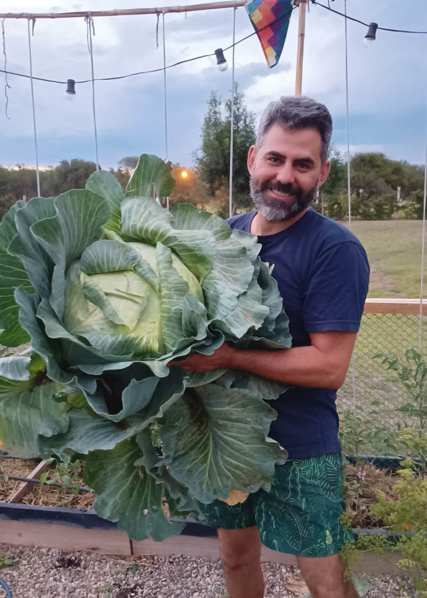
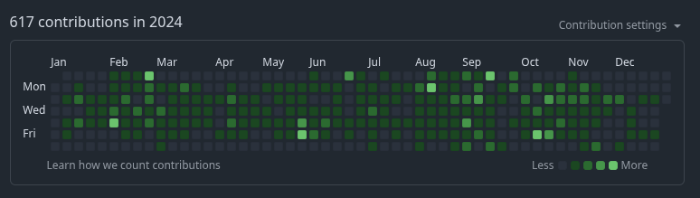
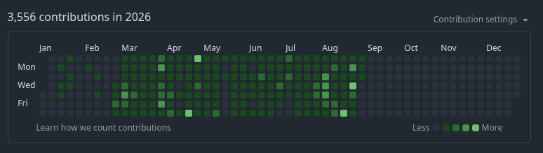
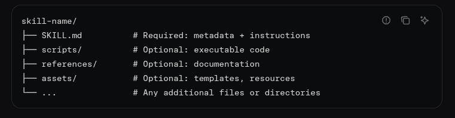
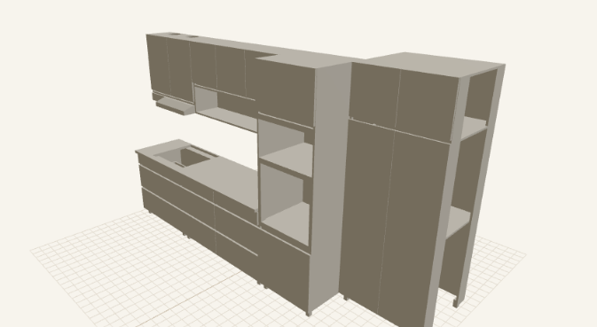
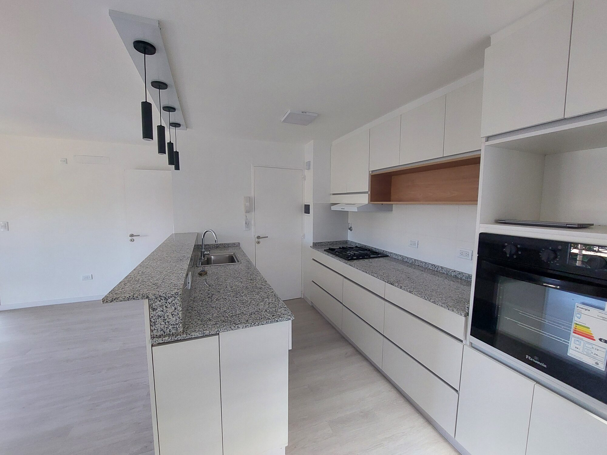
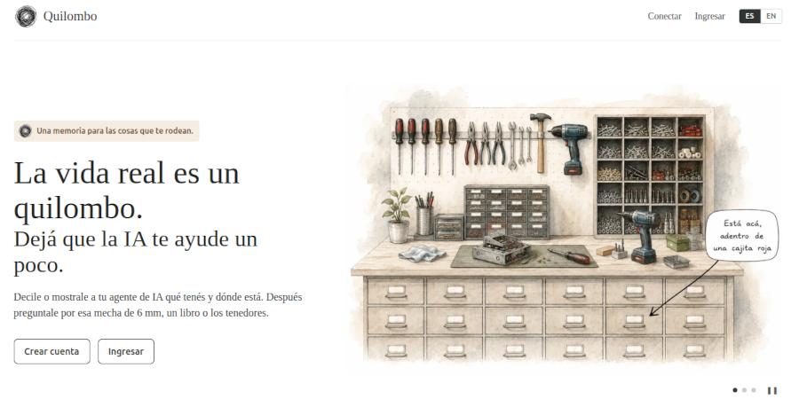
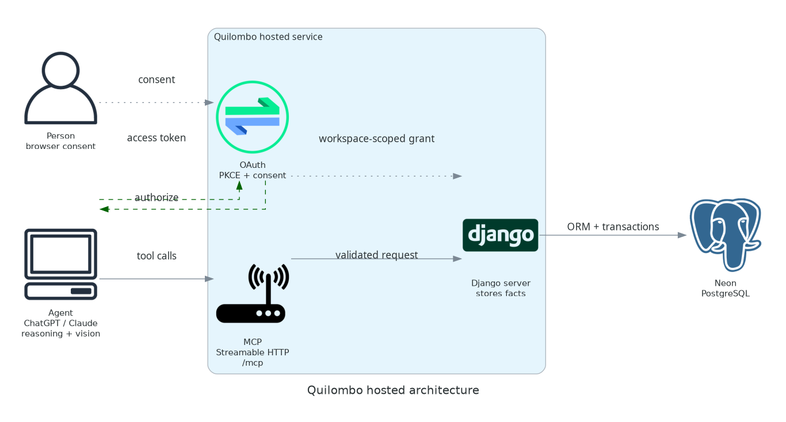

# 🛠️ IA para la vida real🍷 

:::{revealjs-section}
:data-background-size: cover
:data-background-position: center
:data-background-opacity: 0.25
:::

Martín Gaitán / [@tin_nqn_](https://x.com/tin_nqn_)<br>
1º Jornada "IA en acción" - [mit.org.ar](https://mit.org.ar/)

## Presentación

- Me dicen Tin (aunque soy más bien un plomo)
- 25+ años creando software por gusto y a veces por plata
- Me sabía PEP8 de memoria. 
- Farmeo <strike>aura</strike> repollos

### 


## El futuro llegó, hace rato

```{epigraph}
"The goal of the future is full unemployment, so we can play."
-- Arthur C. Clarke
```

```{epigraph}
"El futuro es nuestro, por prepotencia de trabajo"
-- Roberto Arlt
```

## No sé lo que quiero, pero lo quiero IA




## Mis proyectos IA 

- skills
- telegram-acp-bot
- Quilombo
- Otros

## Skills

- Prompts reusables empaquetados. 
- Titulo y descripción en header para "indexar"
- Especializados y aumentados con scripts y recursos

[](https://agentskills.io/specification)

### [arca-skills](https://github.com/mgaitan/arca-skills/)

- Navegar el inframundo del sitio web de Arca
- vercel's [agent-browser](https://agent-browser.dev/)
- resuelve cuits! 

``` 
facturar a Lambda Sistemas por 2500 dólares en pesos
Hacer Factura E a Ruth Puentes por 514 dólares
Facturar esta transferencia recibida <captura>
Nota de Crédito de la última factura a Lambda SRL
```

### [bip-homebanking-skills](https://github.com/mgaitan/bip-homebanking-skills)

Manejar homebanking del Banco Provincia

```
qué saldo tengo en pesos y dólares.
¿ya entró una transferencia por 1.320.100 pesos?
dame los últimos movimientos bancarios
Listá los créditos de la cuenta en dólares del último mes.
Buscá débitos entre el 1 y el 15 de agosto.
¿hay ordenes de Pago del exterior para cerrar?
Cerrá el cambio de la orden de pago 643213000.
```

### [freecad-furnitures-skill](https://github.com/mgaitan/freecad-furnitures-skill)

- Usa un plugin para dibujar en Freecad 
- Reglas de "oficio". 
  - "mesada estandar a 900mm de alto y 600 de profundidad" 
  - "alacena 300 de profundidad"
  - "dejá 2mm de luz entre puertas"  
- Scripts: optimizador 2d, enviar pedido, reporte pdf, web, exportar modelos

### 


### PD: Depto en venta, espectacular


## [telegram-acp-bot](https://github.com/mgaitan/telegram-acp-bot)

[Agent Client Protocol](https://agentclientprotocol.com/get-started/introduction)

Separar clientes (IDEs, editores, TUIs,) del agente (de "codigo" u otros).

eg.  Zed <-> ACP <-> codex

<small>naming is hard: hay otro [ACP](https://agentcommunicationprotocol.dev/introduction/welcome)</small>

### 

<iframe
      src="https://www.youtube.com/embed/QvLoZkhAbqA"
      title="Telegram ACP bot demo"
      loading="lazy"
      allow="accelerometer; autoplay; clipboard-write; encrypted-media; gyroscope; picture-in-picture; web-share"
      allowfullscreen>
</iframe>

## [quilombo.life](http://quilombo.life/)



```
¿Dónde hay cueritos para canilla de 1/2?
Recordá que estos libros estan en el primer estante de la biblioteca 
<fotos>
```

### Agente, agente (arresteme pronto)

- El agente **sabe usar** tu base de datos. Apto para Oscar, mi suegro. 
- Un "chat IA" moderno ya es un *agente* con acceso a MCP remoto. 
- Ejemplo [indexar con fotos via chatgpt](https://chatgpt.com/share/6a919489-c738-83e9-8b62-5bbedc6c6872)
- [Buscar libros](https://chatgpt.com/share/6a91bc09-dff8-83e9-8344-fdbde36bff76)

### MCP: el "usb-c" de la IA



## Otros proyectos

- [markdown.fastapicloud.dev](https://markdown.fastapicloud.dev/)
- [textual-tetris](https://github.com/mgaitan/textual-tetris) como bench para que agentes compitan
- [dictionary.fastapicloud.dev](https://dictionary.fastapicloud.dev)  <- hago reverse-eng de diccionarios de idiomas
- mi ["harness"](https://github.com/mgaitan/python-package-copier-template) para proyectos Python.

## ¡IA cállate, cállate que me desesperas!

Necesito colaboración humana y se aceptan [ ☕cafecitos](https://cafecito.app/tin_nqn_)/o donación de tokens.
